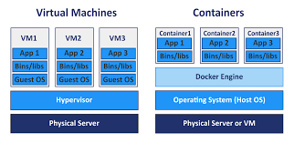

# Docker
## 安裝docker-compose

- `curl -L "https://github.com/docker/compose/releases/download/1.27.3/docker-compose-$(uname -s)-$(uname -m)" -o /usr/local/bin/docker-compose`

- `chmod +x /usr/local/bin/docker-compose`

## docker簡介

- 較輕量的虛擬化技術

    

- aufs(advanced multi-layered unification filesystem)
    
    - 當系統封裝完，就變成read-only

    - 新的變動會覆蓋舊的系統

- 鏡像(image)

    - 一個完整的封裝系統檔案

    - 一個完整鏡像位置 `倉儲來源位置 / 帳號 / 鏡像名稱 : 標籤`

        - 官方帳號可以省略前兩個
        
        - 標籤若是latest可以省略

- 容器(container)是一個隔離環境

    命名空間|用途
    -|-
    MNT (Mount) | 管理檔案系統的掛載點 (mount point)。
    PID (Process) | 隔離執行程序。
    NET (Network) | 管理網路介面。
    IPC (Inter-process communication) | 管理執行程序之間的通訊資源。
    UTS (Host name) | 隔離系統核心版本與識別碼。
    CGROUPS | 限制、隔離、累計各執行程序的資源用量。
    User ID (User) | 提供權限隔離與使用者身分區隔。

## docker指令

- `docker pull` : 下載鏡像

- `docker run` : 運行容器

    - `-p 8080:80` : 將虛擬機的8080port對應到容器的80port

- `docker ps` : 顯示容器的資訊

    - `-a` : 顯示所有容器

    - `-q` : 只顯示ID

- `docker log` : 顯示容器紀錄

- `docker rm` : 刪除容器

    - `-f` : 強制刪除正在運行的容器

- `docker tag` : 給予鏡像別名

- `docker login` : 登入docker hub

- `docker push` : 上傳鏡像

- `docker rmi` : 刪除鏡像

---

**參考資料:**

- [centos7-docker](https://hub.docker.com/_/centos)
- [docker-compose](https://docs.docker.com/compose/install/)
- [dockerhub httpd](https://hub.docker.com/_/httpd)