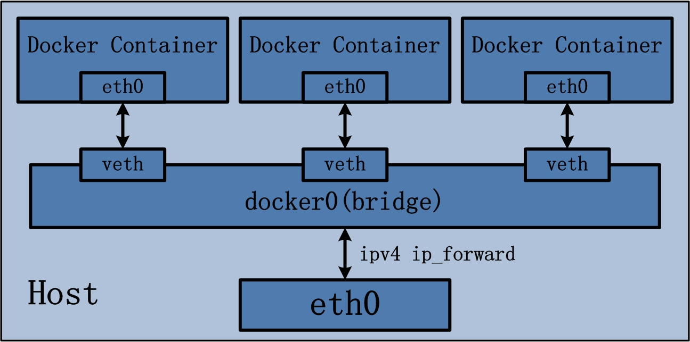

# 建立Docker私有倉儲
## Docker指令
- `docker save -o myhttpd.tar 417` : 將鏡像檔匯出成myhttpd.tar
- `scp myhttpd.tar user@192.168.56.102:/home/user` : 將檔案拷貝到另一台機器
- `docker load -i myhttpd.tar` : 匯入鏡像檔
- `docker tag 417 ping/httpd:1.0`
- `docker stats` : 容器分析
- `docker logs` : 看容器的紀錄
- `docker run`
    - `-e` : 設置環境變量
    - `--restart=always` : 重新開機時，自動開啟
    - `--network` : 設定網路型態，預設為bridge
- `docker inspect` : 檢視容器相關資訊
## 安裝Harbor
1. `cd /`
3. `wget http://csie.nqu.edu.tw/smallko/harbor1.9.0.tgz`
4. `tar -zxvf harbor1.9.0.tgz`
5. `vim harbor.yml`
    ```yml
    hostname: 192.168.56.101
    harbor_admin_password: admin
    ```
6. `./install.sh`
7. 至瀏覽器輸入`192.168.56.109`
## 將鏡像檔推上Harbor
1. `vim /etc/docker/daemon.json`
    ```json
    { 
    "insecure-registries":["192.168.56.109"] 
    }
    ```
2. `systemctl daemon-reload`
3. `systemctl restart docker.service`
4. `docker-compose down`
5. `docker-compose up -d`
6. `docker login 192.168.56.109`
7. `docker tag 417 192.168.56.109/library/myhttpd:1.0`
8. `docker push 192.168.56.109/library/myhttpd:1.0`
# Docker網路

Driver|功能
-|-
none|不開啟網路
bridge|橋接網路
host|與主機相同

- bridge

    

- host 
    - 可以利用容器佈署防火牆之類的功能

- `docker network ls` : 查看目前擁有的網路類型
- `brctl show` : 顯示目前擁有的橋接網路
- `docker network create --driver bridge mynet` : 創造另外一個橋接網路
- `docker network connect bridge a1` : 讓a1連到bridge網路
- `docker network disconnect bridge a1` : 讓a1斷開bridge網路
---

**參考資料:**

- [備份 Docker Image 為 tar 檔](https://ithelp.ithome.com.tw/articles/10191387)
- [Harbor](https://github.com/goharbor/harbor)
- [安裝教學](https://kknews.cc/zh-tw/code/5n9poj6.html)
- [Docker網路](https://godleon.github.io/blog/Docker/docker-network-bridge/)