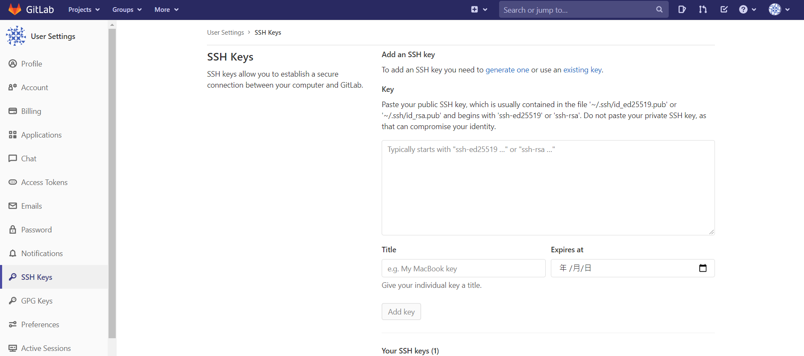
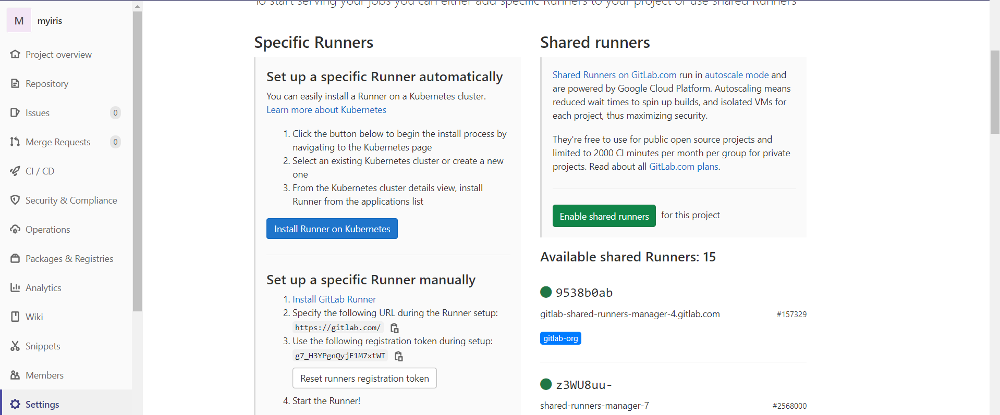
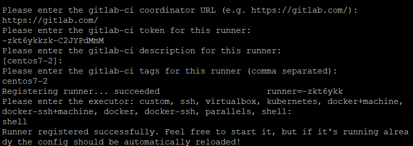

# CI(Continuous integration)/CD(Continuous Deployment)

## 將機器的公鑰傳至Gitlab

- `ssh-keygen`

- `cat /root/.ssh/id_rsa.pub`

- 將公鑰複製到Gitlab的SSH Keys

    

## 將本地端資料push上去

- `git config --global user.name "name"`

- `git config --global user.email "email"`

- `git init`

- `git remote add origin git@gitlab.com:name/projectname.git`

- `git add -A`

- `git commit -m "massage"`

- `git push -u origin master`

## 在第二台機器安裝Gitlab Runner

- `curl -L --output /usr/local/bin/gitlab-runner https://gitlab-runner-downloads.s3.amazonaws.com/latest/binaries/gitlab-runner-linux-amd64`

- `chmod +x /usr/local/bin/gitlab-runner`

- `useradd --comment 'GitLab Runner' --create-home gitlab-runner --shell /bin/bash`

- `usermod -aG docker gitlab-runner` **:** 將gitlab-runner加入docker群組，使其可以使用docker

- `gitlab-runner install --user=gitlab-runner --working-directory=/home/gitlab-runner`

- `gitlab-runner start`

- 到專案裡面的Setting裡的CI/CD裡的Runner複製Token

- 並將Shared runner關閉

    

- `gitlab-runner register`

    - 網址輸入其給的範例就好

    - Token就貼上複製的Token

    - executer使用shell

    

## 在第一台撰寫runner執行腳本

- `vim .gitlab-ci.yml`

    ```yml
    stages:
        - deploy

    docker-deploy:
        stage: deploy
        script: 
            - docker build -t iris .
            - if [ $(docker ps -aq --filter name=iris) ]; then docker rm -f iris; fi
            - docker run -d -p 5000:5000 --name iris iris
        tags:
            - centos7-2
    ```

- `git add -A`

- `git commit -m "create .gitlab-ci.yml"`

- `git push -u origin master`

- 到第二台機器查看是否有開啟iris容器

---
**參考資料:**

- [gitlab-cicd](https://github.com/yangshun2005/gitlab-cicd)
- [Gitlab Runner](https://docs.gitlab.com/runner/install/linux-manually.html)