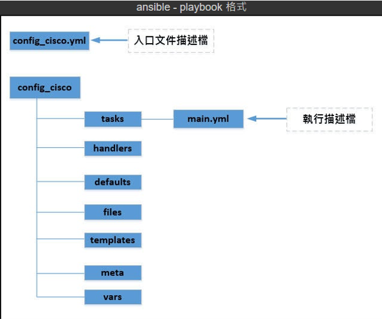
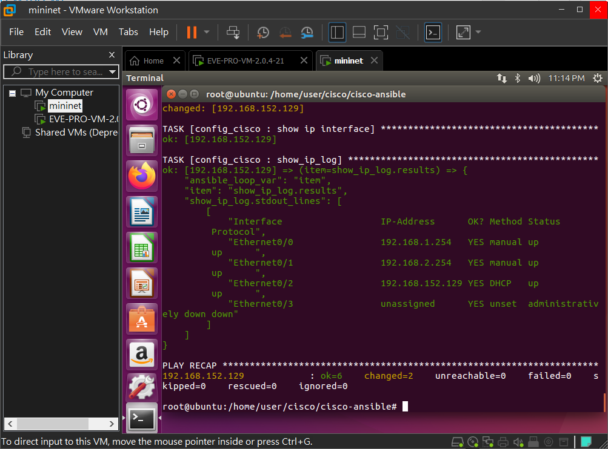
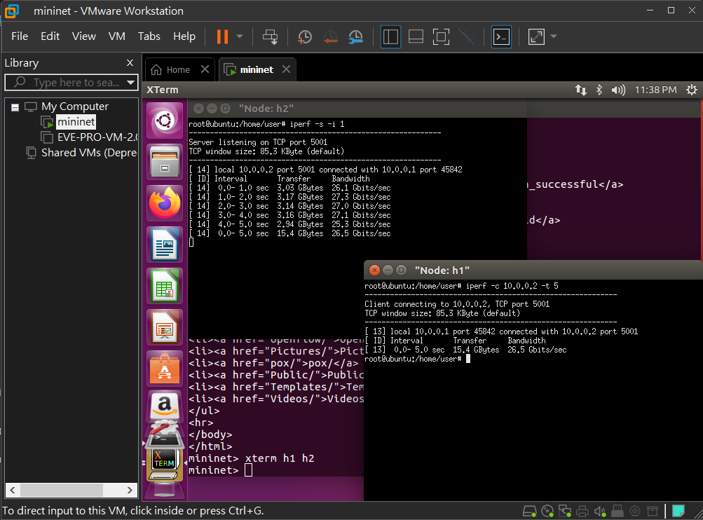

# Ansible-playbook

- cisco

    - R1

        ```
        en
        conf t
        hostname R1
        username cisco password cisco
        enable password cisco
        ip domain-name test.com
        crypto key generate rsa
        ip ssh version 2   
        line vty 0 4    
        login local         
        transport input ssh 
        int e0/2
        ip addr dhcp
        no shut
        do sh ip int bri
        ```

- ubuntu

    

    - `ssh cisco@192.168.152.129`

    - `apt-get install software-properties-common`

    - `apt-add-repository ppa:ansible/ansible`

    - `apt-get update`

    - `apt install ansible`

    - `cd /home/user`

    - `mkdir cisco`

    - `mkdir cisco-ansible`

    - `vim hosts`

        ```
        [cisco]
        192.168.152.129 ansible_connection=local
        ```

    - `vim config_cisco.yml`

        ```
        - hosts: 192.168.153.131
          gather_facts: yes
          vars:
            - cisco_host_ip: 192.168.153.131
              ssh_username: cisco
              ssh_password: cisco
              enable_open: yes
              enable_password: cisco
          roles:
            - config_cisco
        ```
    
    - `mkdir config_cisco`

    - `cd config_cisco`

    - `mkdir tasks`

    - `cd tasks`

    - `vim main.yml`

        ```
        - name: cisco_description_ssh_certification
          set_fact:
            cisco_verification:
            host: "{{cisco_host_ip}}"
            username: "{{ssh_username}}"
            password: "{{ssh_password}}"
            authorize: "{{enable_open}}"
            auth_pass: "{{enable_password}}"

        - name: config e0/0
          ios_config:
            provider: "{{cisco_verification}}"
            parents:  interface Ethernet 0/0     
            lines:
              - ip addr 192.168.1.254 255.255.255.0
              - no shut

        - name: config e0/1
          ios_config:
            provider: "{{cisco_verification}}"
            parents:  interface Ethernet 0/1     
            lines:
              - ip addr 192.168.2.254 255.255.255.0
              - no shut

        - name: show ip interface
          ios_command:
            provider: "{{cisco_verification}}"
            commands: show ip interface brief
          register: show_ip_log

        - name: show_ip_log
          debug:
            var: show_ip_log.stdout_lines
          with_items: show_ip_log.results
        ```

    - `cd ..\..`

    - `ansible-playbook config_cisco.yml -i hosts`

        

# Mininet

- Ubuntu

    - `mn` **:** 開啟 mininet

- mininet

    - `net` **:** 查看網路線路

    - `xterm` **:** 開啟終端機

    - `h1 ifconfig` **:** 直接在對應的機器執行指令

    - `link h1 s1 down` **:** 關閉網路線路

    - `sh ls` **:** sh 可以在 mininet 環境下執行 Linux 指令

## 簡易檢測網路流量

- mininet

    - h2

        - `iperf -s -i 1` **:** tcp 伺服器來監測流量

    - h1

        - `iperf -c 10.0.0.2 -t 5` **:** 連續傳輸五秒封包給 10.0.0.2

            

    - h2

        - `iperf -s -i 1 -u` **:** udp 伺服器來監測流量

    - h1

        - `iperf -c 10.0.0.2 -t 5 -u -b 10M` **:** 連續傳輸五秒10Mb封包給 10.0.0.2 (udp需要指定流量大小)

    - h2

        - `iperf -s -i 1 -u -p 5555` **:** 指定開啟的port號