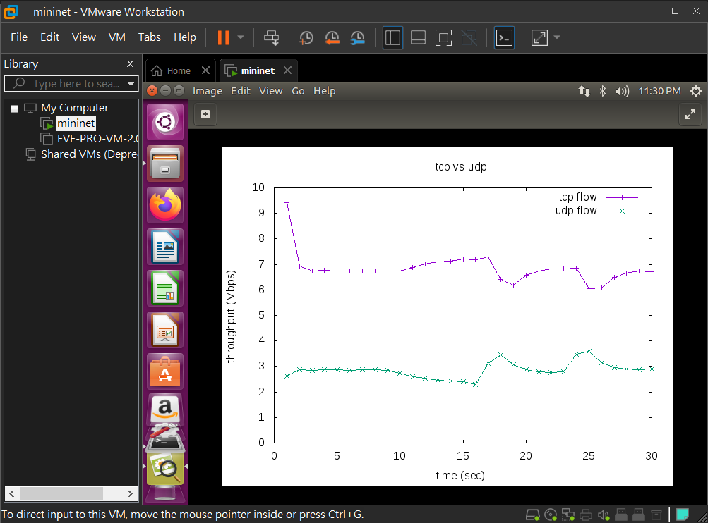
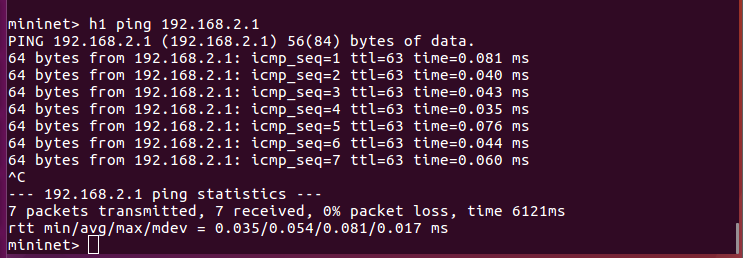
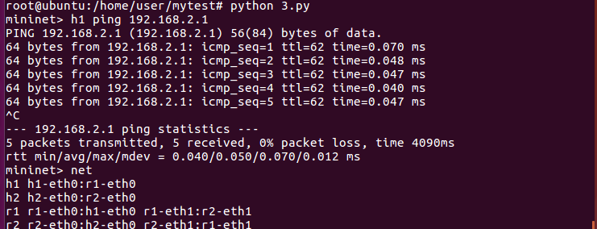

# Mininet

## 同時將兩個檔案圖形化

預設的連線通道沒有限制流量，本身電腦能傳輸多少就會傳輸多少

- ubuntu

    - `mn --link=tc,bw=10,delay='1ms',loss=0` **:** 設定連線通道

- mininet

    - h1

        - `iperf -s -i 1 -p 5555 | tee tcp` **:** tee 可以同時將結果輸出至螢幕並存進檔案

        - `iperf -s -i 1 -p 6666 -u | tee udp`

    - h2

        - `iperf -c 10.0.0.1 -p 5555 -t 30`

        - `iperf -c 10.0.0.1 -p 6666 -t 30 -b 3M`
        

- ubuntu

    - `cat tcp | grep sec | head -n 30 | tr "-" " " | awk '{print $4,$8}' > mytcp.txt`

    - `cat udp | grep sec | head -n 30 | tr "-" " " | awk '{print $4,$8}' > myudp.txt`

    - `gnuplot`

- gnuplot

    - `plot "mytcp.txt" title "tcp flow" with linespoints, "myudp.txt" title "udp flow" with linespoints`

    - `set xrange [0:30]`

    - `set xtics 0,5,30`

    - `set xlabel "time (sec)"`

    - `set yrange [0:10]`

    - `set ytics 0,1,10`

    - `set ylabel "throughput (Mbps)"`

    - `set title "tcp vs. udp`

    - `set terminal "gif"`

    - `set output "result.gif"`

    - `replot`

        

## 腳本建立Mininet

- ubuntu

    - `vim 1.py`

        ```py
        #!/usr/bin/env python
        from mininet.cli import CLI
        from mininet.net import Mininet
        from mininet.link import Link,TCLink
        
        if '__main__' == __name__:
          net = Mininet(link=TCLink)
          h1 = net.addHost('h1')
          h2 = net.addHost('h2')
          Link(h1, h2)
          net.build()
          CLI(net)
          net.stop()
        ```
    
    - `python 1.py`

        

    - `vim 2.py`

        ```py
        #!/usr/bin/env python
        from mininet.cli import CLI
        from mininet.net import Mininet
        from mininet.link import Link,TCLink
        
        if '__main__' == __name__:
          net = Mininet(link=TCLink)
          h1 = net.addHost('h1')
          h2 = net.addHost('h2')
          r = net.addHost('r')
          Link(h1, r)
          Link(h2, r)
          net.build()
          h1.cmd("ifconfig h1-eth0 0")
          h1.cmd("ip addr add 192.168.1.1/24 brd + dev h1-eth0")
          h1.cmd("ip route add default via 192.168.1.254")
          h2.cmd("ifconfig h2-eth0 0")
          h2.cmd("ip addr add 192.168.2.1/24 brd + dev h2-eth0")
          h2.cmd("ip route add default via 192.168.2.254")
          r.cmd("ifconfig r-eth0 0")
          r.cmd("ip addr add 192.168.1.254/24 brd + dev r-eth0")
          r.cmd("ifconfig r-eth1 0")
          r.cmd("ip addr add 192.168.2.254/24 brd + dev r-eth1")
          r.cmd("echo 1 > /proc/sys/net/ipv4/ip_forward")
          CLI(net)
          net.stop()
        ```

    - `python 2.py`

        

    - `vim 3.py`

        ```py
        #!/usr/bin/env python
        from mininet.cli import CLI
        from mininet.net import Mininet
        from mininet.link import Link,TCLink
        
        if '__main__' == __name__:
          net = Mininet(link=TCLink)
          h1 = net.addHost('h1')
          h2 = net.addHost('h2')
          r1 = net.addHost('r1')
          r2 = net.addHost('r2')
          Link(h1, r1)
          Link(h2, r2)
          Link(r1, r2)
          net.build()
          h1.cmd("ifconfig h1-eth0 0")
          h1.cmd("ip addr add 192.168.1.1/24 brd + dev h1-eth0")
          h1.cmd("ip route add default via 192.168.1.254")
          h2.cmd("ifconfig h2-eth0 0")
          h2.cmd("ip addr add 192.168.2.1/24 brd + dev h2-eth0")
          h2.cmd("ip route add default via 192.168.2.254")
          r1.cmd("ifconfig r1-eth0 0")
          r1.cmd("ip addr add 192.168.1.254/24 brd + dev r1-eth0")
          r1.cmd("ifconfig r1-eth1 0")
          r1.cmd("ip addr add 10.0.0.1/24 brd + dev r1-eth1")
          r1.cmd("ip route add 192.168.2.0/24 via 10.0.0.2")
          r1.cmd("echo 1 > /proc/sys/net/ipv4/ip_forward")
          r2.cmd("ifconfig r2-eth0 0")
          r2.cmd("ip addr add 192.168.2.254/24 brd + dev r2-eth0")
          r2.cmd("ifconfig r2-eth1 0")
          r2.cmd("ip addr add 10.0.0.2/24 brd + dev r2-eth1")
          r2.cmd("ip route add 192.168.1.0/24 via 10.0.0.1")
          r2.cmd("echo 1 > /proc/sys/net/ipv4/ip_forward")
          CLI(net)
          net.stop()
        ```

    - `python 3.py`

        
        
# Mininet-wifi

- 檔案下載

    - http://csie.nqu.edu.tw/smallko/mininet-wifidockerp4.zip

    - http://192.168.60.15/smallko/mininet-wifidockerp4.zip