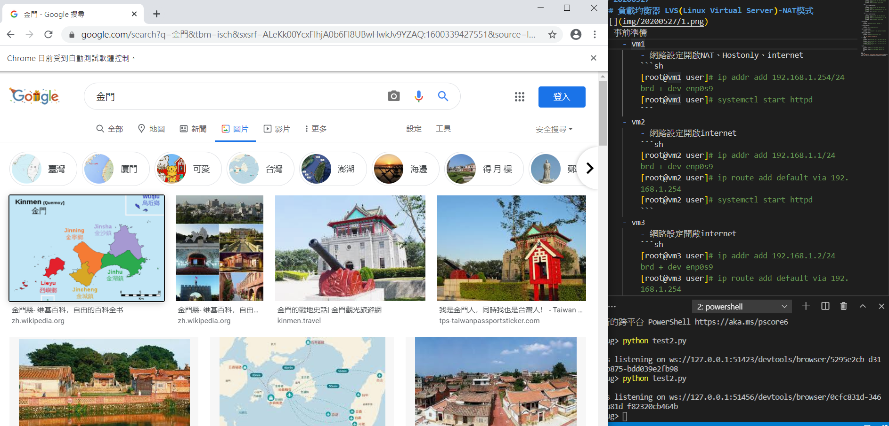

# 下載多個Google搜尋圖片

## 製作動機

在大學三年級時，進行深度學習的模型訓練中發現，我們的資料集數量缺乏，於是想從網路上抓取圖片加進資料集，但是手動的方式有點累人，然後之前有看到自動操作瀏覽器的Python套件，就來試試看可不可以用Python寫一個自動下載圖片的程式，免得浪費人力在下載圖片這種小事情。

## 製作方法

通過三個套件 : Selenium、PyKeyBoard、Pyperclip，自動化的控制電腦去下載圖片。流程圖如下所示。首先需要下載chromedriver讓Selenium可以打開瀏覽器，透過圖片的xpath來控制圖片，再來使用Selenium右鍵它，PyKeyBoard按下V鍵進行另存圖片，Pyperclip複製下載目的地的路徑，PyKeyBoard按下Ctrl+V再按下Enter，即成功儲存。(本來是用PyKeyBoard輸入目的地的路徑，不過發現使用複製更加迅速)

- 流程圖

    

## 實作畫面



## 程式碼

```py
#下載google圖片搜尋的圖片
#使用前請先將chromedriver更新至對應版本，並將輸入法鎖定在英文
#使用範例: python test2.py [a=網址] [t=次數] [s=儲存位置]
#網址ex:"https://www.google.com/search?q=%E9%87%91%E9%96%80&tbm=isch&sxsrf=ALeKk00YcxFlhjA0b6Fl8UBwHwkJv9YZAQ:1600339427551&source=lnms&sa=X&ved=0ahUKEwjol-X4gPDrAhWuGaYKHeFjCkoQ_AUIDSgD&biw=1707&bih=748&dpr=1.13"
#次數ex:3
#儲存位置:"F:\Bug"

#pip install selenium
#git clone https://github.com/PyUserInput/PyUserInput.git 
#cd .\PyUserInput\
#python setup.py install
#pip install pyperclip

from selenium import webdriver
from selenium.webdriver.common.action_chains import ActionChains
from pykeyboard import PyKeyboard
import pyperclip
import time
import sys

driver = webdriver.Chrome()  
i, count, address, times, savedir = 0, 0, None, None, None

if len(sys.argv) > 1 :
    for argv in sys.argv[1:] :
        name, setting = argv.split('=')[0], argv.split('=')[1]
        if name == "a" : 
            address = setting
        elif name == "t" : 
            times = int(setting)
        elif name == "s" : 
            savedir = setting

    

if address == None :
    #預設網址
    address = "https://www.google.com/search?q=%E9%87%91%E9%96%80&tbm=isch&sxsrf=ALeKk00YcxFlhjA0b6Fl8UBwHwkJv9YZAQ:1600339427551&source=lnms&sa=X&ved=0ahUKEwjol-X4gPDrAhWuGaYKHeFjCkoQ_AUIDSgD&biw=1707&bih=748&dpr=1.13"

if times == None :
    #預設次數
    times = 1

if savedir == None :
    #預設儲存位置
    savedir = "F:\\Bug\\images"

driver.get(address)

while(times>0):
    try:
        imgposition = driver.find_elements_by_xpath("//img[@class='rg_i Q4LuWd']")[count]        
        action = ActionChains(driver)
        action.context_click(imgposition).perform()
        k = PyKeyboard()
        k.tap_key('v')
        time.sleep(1)
        #k.tap_key(k.shift_r_key)
        s = savedir + "\\img_{}.jpg".format(count)
        pyperclip.copy(s)
        time.sleep(0.25)
        k.press_key(k.control_key)
        k.tap_key('v')
        k.release_key(k.control_key)
        time.sleep(0.25)
        k.tap_key(k.enter_key)
        count += 1
        times -= 1
    except:
        action = ActionChains(driver)
        btnposition = driver.find_element_by_xpath("//input[@class='mye4qd']")
        action.click(btnposition).perform()
        time.sleep(1)

#driver.close()
```

---

**參考資料:**

- [selenium基本操作](https://freelancerlife.info/zh/blog/python%E7%B6%B2%E8%B7%AF%E7%88%AC%E8%9F%B2%E6%95%99%E5%AD%B8-selenium%E5%9F%BA%E6%9C%AC%E6%93%8D%E4%BD%9C/)
- [python鍵盤與黏貼](https://blog.csdn.net/killvirus007/article/details/89497833)